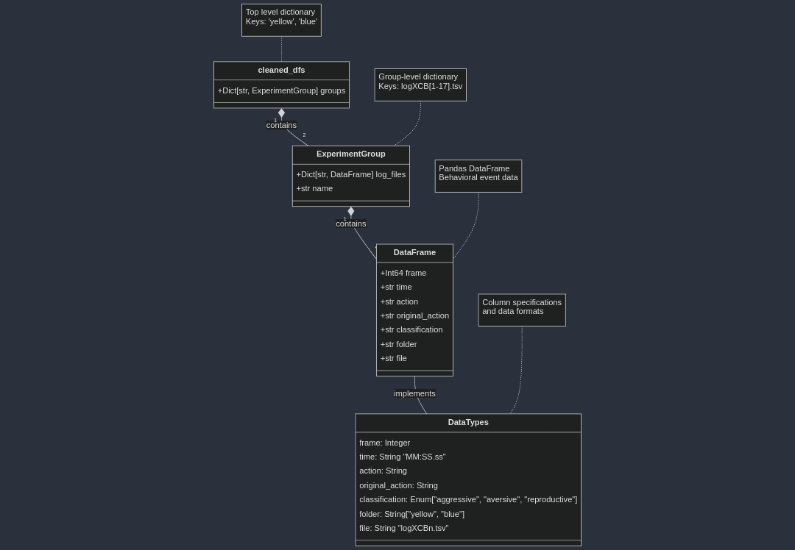

# Behavioral Analysis Tool

A Python-based tool for analyzing and visualizing behavioral patterns from experimental data. This tool processes behavioral event logs, generates transition matrices, and creates Markov chain visualizations of behavioral sequences.

## Features

- Extract and process behavioral event logs
- Calculate time spent in different behavioral states
- Generate behavior transition matrices
- Create probability-based Markov chain visualizations
- Analyze behavioral classifications
- Export analysis results to CSV files

## Installation

1. Clone the repository:
```bash
git clone https://github.com/yourusername/behavioral-analysis.git
cd behavioral-analysis
```

2. Create and activate a virtual environment (recommended):
```bash
python -m venv venv
# On Windows:
venv\Scripts\activate
# On Unix or MacOS:
source venv/bin/activate
```

3. Install required packages:
```bash
pip install -r requirements.txt
```

## Usage

1. Prepare your data:
   - Place your behavioral log files (.tsv format) in the `data` directory
   - Ensure your behavior mappings are defined in `behaviors.csv`

2. Basic usage:
```python
from analysis import BehaviorExtractor

# Initialize and load data
ext = BehaviorExtractor()
ext.extract_folder('data')

# List available files
ext.list_all_files()

# Generate basic analysis
ext.print_behavior_summary()
ext.print_classification_summary()

# Create visualization
ext.plot_markov_graph(palette, threshold=0.1)
```

3. Export results:
```python
# Export all analyses
ext.export_analyses('output')

# Export summary statistics
ext.export_summary_stats('summary_stats_output')

# Export transition statistics
ext.export_transition_summary_stats('transition_stats_output')
```

## Data Format

### Input Files
- Behavioral log files should be in TSV format
- Required columns: frame, time, action
- See example files in the repository for reference

### Pre-processed Data Compatibility
The tool can accommodate pre-processed CSV/TSV files if they follow this structure:

```
cleaned_dfs/
    ├── yellow/   # Experimental group 1
    │   ├── logXCB1.tsv
    │   ├── logXCB3.tsv
    │   └── ...
    └── blue/     # Experimental group 2
        ├── logXCB1.tsv
        ├── logXCB3.tsv
        └── ...
```

Each TSV file must contain these columns:
1. frame: Video frame number
2. time: Timestamp (MM:SS.ss format)
3. action: Standardized behavior name
4. original_action: Raw behavior name
5. classification: Behavior category (aggressive/aversive/reproductive)
6. folder: Group name (yellow/blue)
7. file: Source filename

This format allows researchers to use their own pre-processing pipelines while maintaining compatibility with the analysis tools.
### Input Files
- Required columns: frame, time, action
- See example files in the repository for reference

### Configuration
- `behaviors.csv` defines behavior classifications and display names
- Required columns: Behavior, Classification, ReplaceWith

## Examples

Check the `Demo.ipynb` notebook for detailed examples of:
- Loading and processing data
- Generating different types of analyses
- Creating visualizations
- Exporting results


## License

This project is licensed under the MIT License - see the LICENSE file for details.
